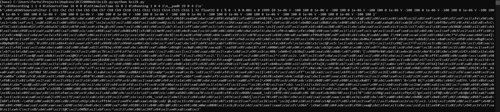

# bci2k.py

A python connector for BCI2000

- BCI2k_parser.py: python script of the corresponding + Jupyter notebook
- bci2k.py: Future core module to connect and read from BCI2000
- bci2k.js: copy from bci2k.js repo

### Example output (i.e. what we need to parse)

